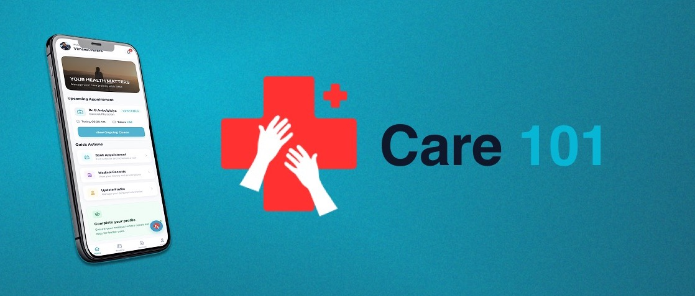

<div align="center">

[](./LICENSE)
[](https://nodejs.org/)
[](https://nextjs.org/)
[](https://expo.dev/)

</div>

# Care101

<div align="center">
  
</div>

Care101 is a healthcare platform built to connect patients, doctors, and administrators in one streamlined system. It brings together patient access, doctor workflows, AI-assisted assistance, billing, appointment tracking, and operational management in a modern digital experience.

## Overview

The platform includes:

- A web portal for patients and administrators
- A mobile app for doctors and patients
- A Node.js backend for business logic, APIs, authentication, AI features, and payment processing
- MongoDB-powered data management for healthcare records and workflows

## Core Features

- Appointment scheduling and tracking
- Patient and doctor profile management
- AI-assisted support and healthcare workflow automation
- Medical records and consultation history
- Lab and surgery tracking
- Notifications and updates
- Finance and billing operations
- Secure authentication and role-based access control

## Project Structure

- frontend/ — Patient portal and admin web app built with Next.js
- backend/ — Express API, MongoDB models, services, and middleware
- care101_app/ — Expo-based mobile application for doctors and patients

## Tech Stack

### Web Frontend
- Next.js 15
- TypeScript
- Tailwind CSS
- Radix UI
- Framer Motion
- Lucide React

### Backend
- Node.js
- Express.js
- MongoDB with Mongoose
- JWT authentication
- Bcrypt password hashing
- Stripe payments
- NVIDIA AI integration
- Local uploads storage for generated files

### Mobile App
- Expo
- React Native
- TypeScript
- NativeWind
- Expo Router
- AsyncStorage / Secure Store
- Stripe React Native SDK

---

## Prerequisites

Before starting the app, make sure you have:

- Node.js v18 or later
- npm or yarn
- MongoDB instance (local or Atlas)
- Expo CLI for the mobile app

---

## 1. Backend Setup

From the project root:

```bash
cd backend
npm install
```

Create a `.env` file inside `backend/` with the required variables:

```env
PORT=5000
MONGO_URI=your_mongodb_connection_string
JWT_SECRET=your_jwt_secret
STRIPE_SECRET_KEY=your_stripe_secret_key
NVIDIA_API_KEY=your_nvidia_api_key
```

Then start the server:

```bash
npm run dev
```

The backend should run at:

```text
http://localhost:5000
```

---

## 2. Frontend Setup

```bash
cd frontend
npm install
```

Create a `.env` file inside `frontend/`:

```env
NEXT_PUBLIC_API_URL=http://localhost:5000/api
```

Start the app:

```bash
npm run dev
```

The frontend should run at:

```text
http://localhost:3000
```

---

## 3. Mobile App Setup

```bash
cd care101_app
npm install
```

Create a `.env` file inside `care101_app/`:

```env
EXPO_PUBLIC_API_URL=http://your_local_ip:5000/api
EXPO_PUBLIC_STRIPE_PUBLISHABLE_KEY=your_stripe_publishable_key
```

To find your local IP on macOS:

```bash
ipconfig getifaddr en0
```
To find your local IP on Windows:

```bash
ipconfig
```

Then run the app:

```bash
npx expo start
```

Use Expo Go on your phone or an emulator to scan the QR code.

---

## Typical Local Development Flow

1. Start MongoDB
2. Start backend
3. Start frontend
4. Start mobile app
5. Sign in with your configured users or create test accounts

---

## Documentation

For production deployment and build guidance, see the build guide in the repository documentation.

---

## License

This project is licensed under the ISC License.

## Author

- Damiduuofc

